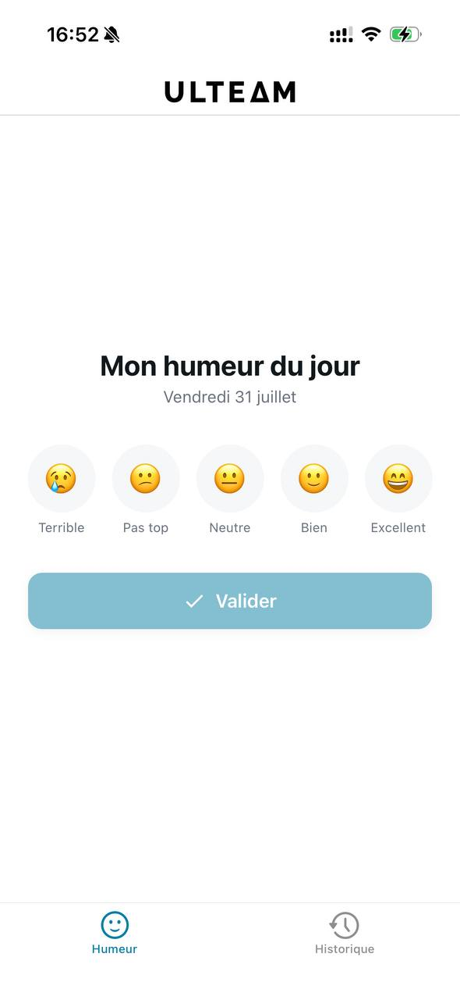
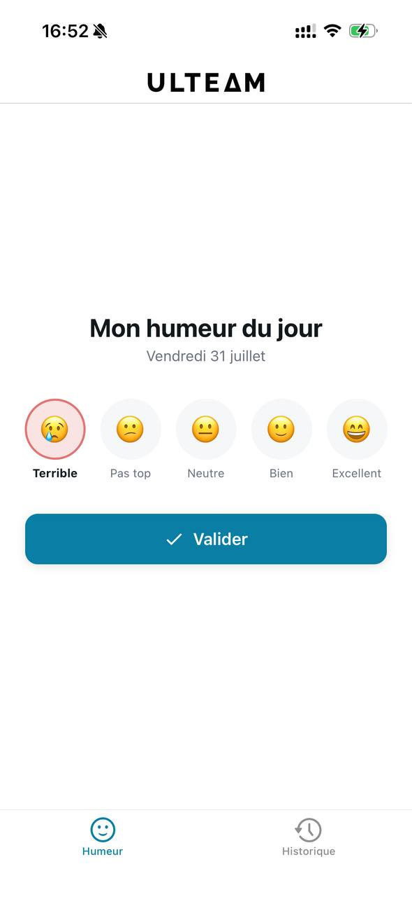
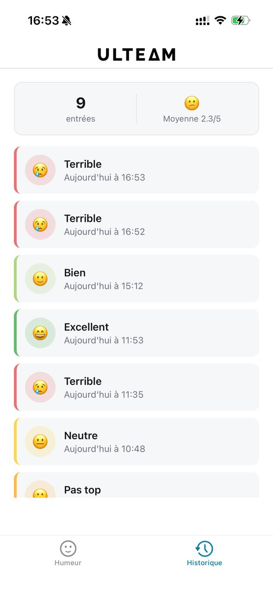
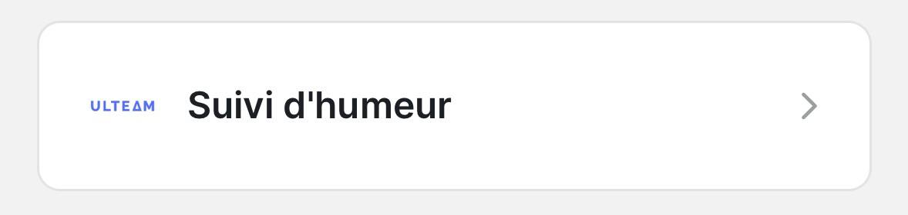
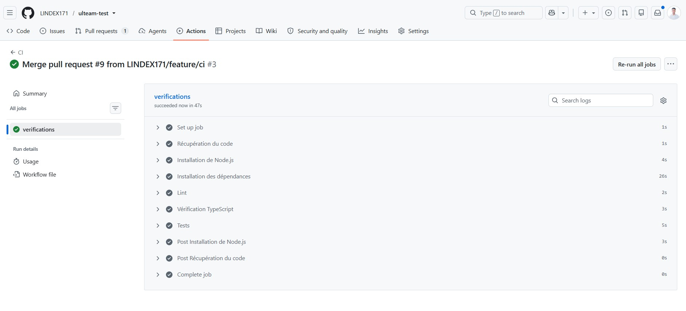
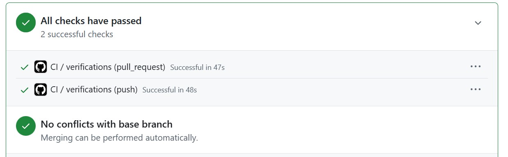

# Suivi d'humeur - Test technique ULTEAM

Application React Native (Expo) de suivi d'humeur quotidien : un écran de saisie pour enregistrer son humeur du jour, et un écran d'historique pour consulter les entrées passées.

## Aperçu

### Captures d'écran

| Écran de saisie (par défaut) | Sélection d'un niveau |
|---|---|
|  |  |

| Après validation | Historique |
|---|---|
|  |  |

L'icône ULTEAM personnalisée apparaît aussi dans la liste "Recently opened" d'Expo Go :



### Vidéo de démonstration

https://github.com/user-attachments/assets/d266dff5-bda3-432b-9645-ac5a21f36eee

## Fonctionnalités

### Socle obligatoire

- **Écran de saisie d'humeur** : 5 niveaux (emoji + label), sélection via `useState`, validation avec appel `POST` (`fetch` + `try/catch`), `ActivityIndicator` pendant l'envoi, message de succès/erreur après coup
- **Écran historique** : chargement via `GET` (API simulée mockapi.io), gestion des 3 états `loading`/`data`/`error` avec `useEffect`, affichage en `FlatList`, message d'erreur + bouton "Réessayer" en cas d'échec
- **Navigation** entre les deux écrans via Expo Router (barre d'onglets)
- **TypeScript** sur l'ensemble du projet

### Bonus implémentés

- **Context API** (`contexts/humeur-context.tsx`) : centralise le chargement, l'ajout et le tri des humeurs, partagé entre les deux écrans (plus besoin de recharger l'historique après un ajout)
- **AsyncStorage** : l'historique reste consultable hors connexion (dernière copie synchronisée sauvegardée localement)
- **Tests unitaires et d'intégration** (Jest + Testing Library) : voir [Tests](#tests)
- **Pipeline CI** (GitHub Actions) : lint + vérification TypeScript + tests à chaque push/PR
- **Soin de l'interface** : thème clair/sombre automatique, navbar avec logo, animations légères (sélection, apparition de liste), pull-to-refresh, résumé statistique (nombre d'entrées + humeur moyenne)

## Choix techniques

### Architecture & navigation

- **Expo (managed workflow)** plutôt que du React Native "bare" : pas de configuration native (Xcode/Android Studio) à gérer, tests immédiats sur téléphone via Expo Go.
- **Expo Router** plutôt que React Navigation configuré à la main : navigation **basée sur les fichiers** (`app/(tabs)/index.tsx` devient automatiquement une route). Résultat concret : ajouter l'écran Historique s'est fait en créant un seul fichier, sans toucher à un fichier de config de navigation séparé. C'est aussi le standard actuel sur les nouveaux projets Expo (SDK 54).

### Gestion d'état

- **`useState` local** pour l'état propre à un écran et éphémère (le niveau d'humeur sélectionné avant validation, les valeurs d'animation), pas besoin de le partager ailleurs.
- **Context API** (`contexts/humeur-context.tsx`) pour l'état partagé entre les deux écrans (liste des humeurs, chargement, erreur). J'ai délibérément **évité une librairie externe** (Redux, Zustand, Jotai...) : pour 2 écrans et un seul "domaine" de données, un Context + quelques `useState`/`useCallback` suffit très largement. Ajouter Redux ici aurait été de la sur-ingénierie (plus de boilerplate, une dépendance en plus, pour un gain nul à cette échelle).
- Le Context ne fait pas qu'exposer un state : il **encapsule aussi la logique métier** (`chargerHumeurs`, `ajouterHumeur`, tri, synchronisation AsyncStorage), pour que les composants d'écran restent uniquement responsables de l'affichage.

### Réseau & données

- **`fetch` natif** plutôt qu'une librairie comme Axios : le cahier des charges demande explicitement `fetch`, et pour 2 appels HTTP simples (GET/POST), l'API native suffit.
- **mockapi.io** comme backend simulé : zéro serveur à écrire/héberger, un vrai endpoint REST pour tester le flux complet (POST → GET → affichage), conforme à la demande du test.
- **Tri systématique côté client** (`trierParDateDesc` dans le Context) plutôt que de faire confiance à l'ordre renvoyé par l'API : mockapi.io renvoie les entrées par ordre de création, et mélanger "ordre API" et "ajout local en tête de liste" créait une incohérence (bug rencontré et corrigé pendant le développement). Trier explicitement à chaque mise à jour garantit un ordre fiable, peu importe la source des données.

### Persistance locale

- **AsyncStorage** plutôt que SQLite/Realm/WatermelonDB : le volume de données (une liste d'humeurs quotidiennes) est petit, une simple paire clé-valeur JSON suffit une vraie base de données locale aurait été disproportionnée.
- Stratégie : à chaque chargement/ajout réussi, la liste est **sauvegardée en local** ; si le `fetch` échoue (pas de réseau), on **retombe sur cette copie locale** au lieu d'afficher directement une erreur l'historique reste consultable hors ligne.

### Interface & UI

- **Composants React Native natifs** (`View`, `Text`, `TouchableOpacity`, `ActivityIndicator`, `FlatList`) plutôt que des wrappers "thémés" custom fournis par le template de départ : le cahier des charges nomme explicitement ces composants, donc je suis resté au plus près de la demande plutôt que d'ajouter une couche d'abstraction.
- **Thème clair/sombre** géré via `useColorScheme` + un objet `Colors` centralisé (`constants/theme.ts`) : un seul endroit à modifier pour ajuster la palette, cohérence garantie entre les écrans.
- **`constants/humeurs.ts`** comme source unique de vérité pour les 5 niveaux (emoji, label, couleur) : évite de dupliquer ces informations entre l'écran de saisie et l'écran historique.
- **react-native-reanimated** pour les animations de liste (apparition en fondu, repositionnement fluide) : déjà présent dans les dépendances du template Expo (aucune dépendance ajoutée), et ses animations tournent sur le thread natif. Pour les animations plus simples et isolées (rebond d'un bouton, fondu d'un message), j'ai utilisé l'API `Animated` de React Native de base suffisante pour ce cas.
- **react-native-svg** pour afficher le logo ULTEAM (format vectoriel fourni) directement en JS via `SvgXml`, plutôt que de le convertir en PNG et perdre la netteté selon la résolution d'écran.

### Tests (Jest)

- **`jest-expo`** comme preset Jest : c'est le preset officiel Expo, il configure automatiquement les mocks nécessaires pour les modules natifs Expo/React Native, sans configuration manuelle fastidieuse.
- **`@testing-library/react-native`**, avec `renderHook` pour tester le Context **isolément**, sans monter un écran complet : plus rapide, plus ciblé, et évite les faux positifs/négatifs liés au rendu visuel (animations, styles) qui n'ont rien à voir avec la logique testée.
- **`fetch` simulé (mocké)** dans les tests plutôt qu'un vrai appel à mockapi.io : les tests restent rapides, fiables (pas de dépendance à une connexion réseau ou à la disponibilité du service), et reproductibles (le même scénario donne toujours le même résultat).
- **Mock d'AsyncStorage** (`@react-native-async-storage/async-storage/jest/async-storage-mock`, activé dans `jest.setup.js`) : AsyncStorage est un module natif qui n'existe pas dans l'environnement Node.js des tests, donc on le remplace par une version en mémoire.
- Répartition : 2 fichiers de **tests unitaires** (`utils/date.test.ts`, `constants/humeurs.test.ts`) qui testent des fonctions pures isolées, et 1 fichier de **test d'intégration** (`contexts/humeur-context.test.tsx`) qui vérifie que le Context, l'état et les appels réseau simulés fonctionnent bien ensemble.

### Pipeline CI (GitHub Actions)

- Déclenché à **chaque push** (toutes branches) et à **chaque Pull Request vers `main`**, pour détecter les problèmes le plus tôt possible avant même une éventuelle review.
- **`npm ci`** plutôt que `npm install` : installe exactement les versions verrouillées dans `package-lock.json`, pour un environnement de build reproductible, identique à ce que j'ai testé en local.
- Le pipeline enchaîne trois étapes dans un ordre réfléchi : **lint → vérification TypeScript → tests**, de la vérification la plus rapide à la plus longue, pour échouer vite sur un problème simple sans attendre l'exécution complète des tests.
- Le pipeline sert aussi de **garde-fou sur les Pull Requests** : avant chaque merge vers `main`, GitHub affiche directement si le code respecte le lint, compile sans erreur de type, et passe tous les tests.

## Installation et lancement

Prérequis : Node.js, un compte Expo/GitHub, et l'application **Expo Go** installée sur un téléphone (iOS ou Android).

```bash
# Installer les dépendances
npm install

# Lancer le serveur de développement
npx expo start
```

Scanne le QR code affiché dans le terminal avec Expo Go (ou l'appareil photo sur iPhone) pour ouvrir l'application.

L'API mockapi.io est déjà configurée dans `constants/api.ts`  aucune configuration supplémentaire n'est nécessaire pour tester l'application.

## Tests

```bash
npm test
```

Lance les tests unitaires (fonctions utilitaires) et d'intégration (Context, avec un `fetch` simulé  aucun besoin de réseau ni de téléphone).


## Qualité de code

```bash
npm run lint        # ESLint
npm run typecheck   # Vérification des types TypeScript
```

Ces deux commandes, plus `npm test`, sont exécutées automatiquement par la CI GitHub Actions à chaque push et sur chaque Pull Request (voir `.github/workflows/ci.yml`).





## Structure du projet

```
app/(tabs)/index.tsx        Écran de saisie d'humeur
app/(tabs)/historique.tsx   Écran historique
app/(tabs)/_layout.tsx      Navigation par onglets + header
contexts/humeur-context.tsx Context partagé (état, appels API, AsyncStorage)
constants/humeurs.ts        Référentiel des 5 niveaux d'humeur (emoji, label, couleur)
constants/api.ts            URL de l'API mockapi.io
constants/theme.ts          Couleurs (thème clair/sombre)
utils/date.ts                Formatage des dates ("Aujourd'hui à...", "Hier à...")
```

## Limitation connue

L'icône de l'app et l'écran de démarrage (splash screen) personnalisés ne s'affichent pas dans **Expo Go**  c'est une limitation connue d'Expo Go depuis le SDK 52 (Expo Go ne peut pas appliquer la configuration native custom d'un projet). La configuration est correcte et s'appliquera normalement lors d'un vrai build (`expo prebuild` + `expo run:ios`, ou build EAS).

## Ce que j'aurais fait avec plus de temps

- Possibilité de supprimer ou modifier une entrée d'historique
- Un graphique d'évolution de l'humeur sur la semaine/le mois
- Des notifications de rappel quotidien pour saisir son humeur
- Des tests end-to-end (Detox ou Maestro) en plus des tests unitaires/intégration
- Un vrai build EAS pour valider l'icône et le splash screen personnalisés sur un appareil réel
